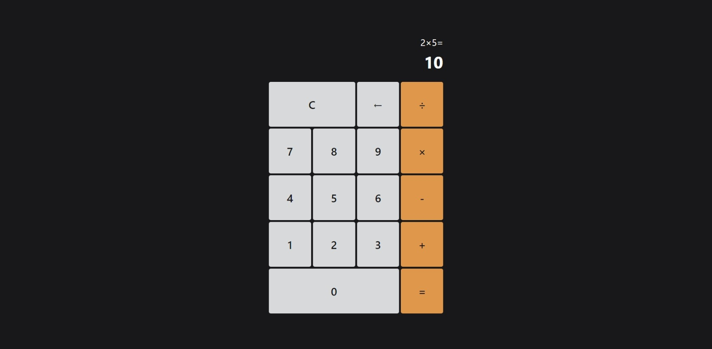
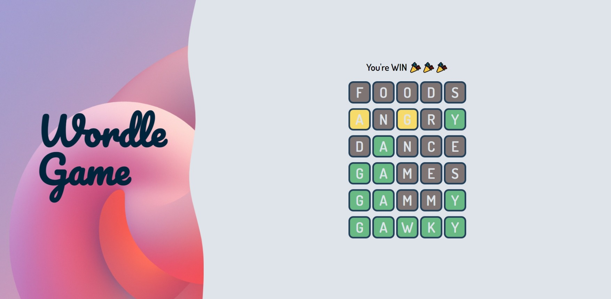

# ✨ Frontendmaster projects ✨ 
## 1. Calculator

  
 <ins>Description:</ins> 

   
  
It consists of three main components: HTML, CSS and JS.

  
  - HTML defines the structure and layout of the calculator, such as the buttons, the display and the input field.
  - CSS styles the appearance of the calculator, such as the colors, fonts and borders.
  - JS adds functionality and interactivity to the calculator, such as handling user input, performing calculations and updating the display.
  

  
 <ins>Preview:</ins> 

   
  
  
  

## 2. Wordle Game

  
 <ins>Description:</ins> 

   
  
Wordle is a popular online game where you have to guess a five-letter word in six tries.
  You get feedback on each guess, such as how many letters are correct (green), close (yellow) or wrong (grey).

  
To play Wordle, we need to call an API that generates a random word for each day.
  We also need to check if the word you enter is valid, meaning it is a five-letter word that exists in the English dictionary.

  
  
We have two APIs to work with:

  
  **GET:** https://words.dev-apis.com/word-of-the-day to get the answer.
  
  **POST:** https://words.dev-apis.com/validate-word to check the word.
  - The endpoint expects JSON with a property called "word". A valid post body would be `{ "word": "dance" }`.
  - The API will return back to you the word you sent and validWord which will be `true` or `false`. e.g. `{ "word": "dance", "validWord": true }` or `{ "word": "abcde", "validWord": false }`.
  

  
 <ins>Preview:</ins> 

   
  
  
  

